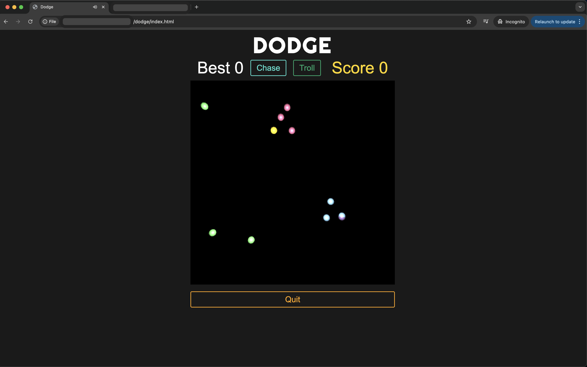

# Dodge

A fast-paced browser game where you dodge enemies and collect gems using Three.js.

## Chase version

## Troll version

## Description

Dodge is a minimalist action game where players navigate a hostile environment, avoiding various enemy types while collecting gems. The game features dynamic difficulty scaling and multiple game modes, all rendered in smooth 3D graphics using Three.js.

## Features

- **Multiple Game Modes**
  - Chase Mode: Face 10 relentless pursuers
  - Troll Mode: Navigate through a mix of 3 different enemy types
  
- **Enemy Types**
  - Chasers: Pursue the player directly
  - Hoggers: Guard and collect gems
  - Trolls: Create vertical patterns to trap players

- **Dynamic Difficulty**
  - Speed increases with score
  - Enemy behavior adapts to player position
  - Interactive enemy auras affect movement patterns

- **Responsive Controls**
  - Precise mouse-based movement
  - Cursor-free gameplay area for immersion
  - Instant response to player input

## Getting Started

### Prerequisites
- A modern web browser

### Installation

1. Clone the repository
2. Open your browser and navigate to `http://localhost:8000`

## How to Play

1. Choose a game mode:
   - **Chase**: Classic pursuit mode
   - **Troll**: Mixed enemy challenge

2. Move your player (purple sphere) with the mouse
3. Collect yellow gems to increase your score
4. Avoid enemies:
   - Blue: Chasers
   - Pink: Hoggers
   - Green: Trolls

5. Press "Quit" to end the game

## Technical Details

### Architecture
- Built with Three.js for 3D rendering
- Object-oriented design with inheritance
- Modular component system
- Efficient collision detection

### Performance
- Optimized render loop
- Efficient geometry reuse
- Smart enemy AI calculations
- Minimal DOM updates

## Contributing

Contributions are welcome! Please feel free to submit a Pull Request.

## License

This project is licensed under the MIT License - see the [LICENSE.md](LICENSE.md) file for details.

## Acknowledgments

- Three.js team for the excellent 3D library